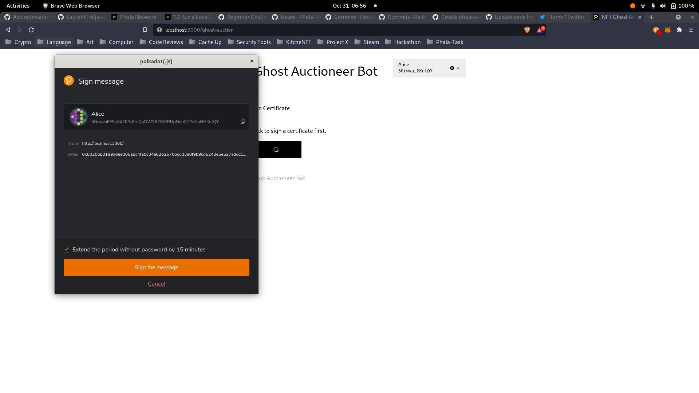
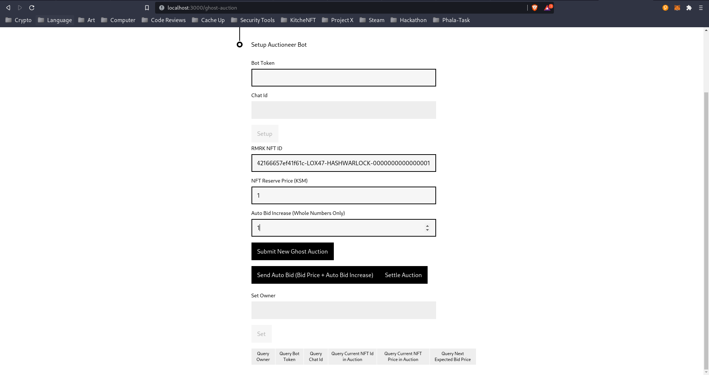
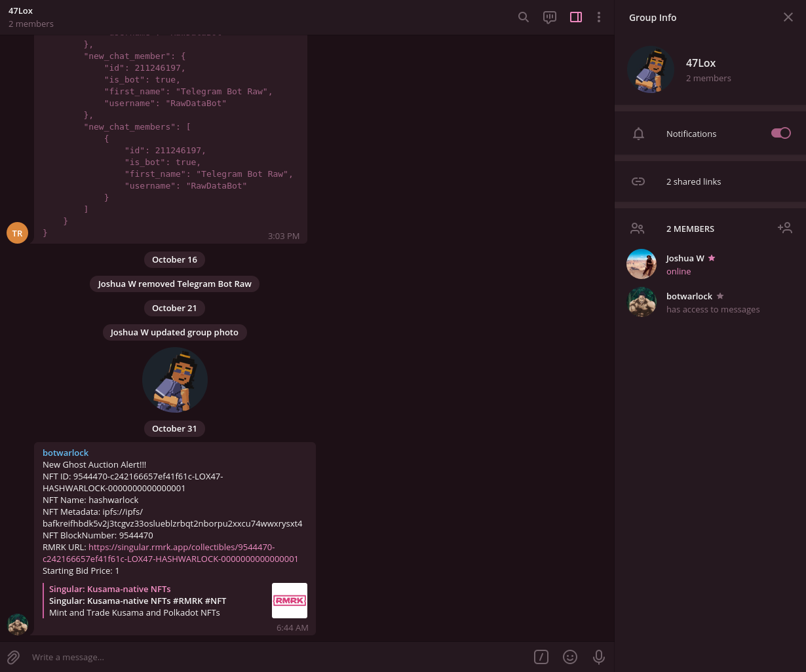

# Phala Ghost Auction w/ RMRK NFTs
#### Disclaimer: 
This project is a work in progress and is not ready for current functionality to run a proper ghost auction with RMRK NFTs. Use this code in experimental environments only.

## Overview
The Phala Confidential Smart Contract offers a unique feature that allows their smart contracts to access HTTP service. Detailed information can be found in their [wiki](https://wiki.phala.network/en-us/docs/developer/your-first-confidential-contract/#advanced-feature-access-http-service-in-confidential-contracts). With this capability, I set out to build a simple ghost auction that would allow NFT artists to run automated auctions while not available on [Singular](https://singular.rmrk.app/). 

A typical example of the UI worklflow is as follows:
### Sign the Smart Contract

### Set Up Auctioneer Bot & Auction Settings

### Submit Auction & Notify Telegram Group

## What's Missing?
- AsyncSideTask result reporting to the blockchain and utilizing the result to change state of smart contract for bid price (`u64`) and bidder (`AccountId`)
- Multiple NFTs per Ghost Auction
- Configurable Auction Timer Settings
- Multi-User Interactions to smart contract state
  - This part is tricky as letting users change state of smart contract
- ghost-auction pallet to handle communication & allow users to bid on the NFT
  - idea would be to use the auction pallet template in [open-runtime-module-library](https://github.com/open-web3-stack/open-runtime-module-library/blob/master/auction/src/lib.rs)
  - create an `AuctionHandler` that can interact with the smart contract through the PolkadotApi
  - store auction details on chain to also validate available funds to bid on the NFT
  - create whitelist of users that can bid on an NFT
- Pretty UI :(
- Functional queries for auction bid information for the NFT
- Rocket Ship

## Pain Points
- First time working with UIs in TypeScript with a blockchain
- Understanding how to fully utilize [AsyncSideTask](https://rust-lang.github.io/async-book/01_getting_started/01_chapter.html) in Phala's confidential smart contracts
  - producing a result to post back to the blockchain & utilizing the result to mutate the smart contract's state
  - multiple commands that generate different bot updates
    - Start of Auction (Done)
    - New Bid Alert (Missing)
    - New Top Bid Alert (Missing)
    - Reveal Period (Missing)
    - Settle Auction (Missing)
- Doing this outside of work hours made time management harder than expected

## What's Next
More learning :) I had a lot of fun participating in this Hackathon as it is actually my first open source Hackathon. I have been learning at a rapid pace & I am so thankful that I am able to learn through the community engagement and help others when they would get stuck. My new biggest goal is to understand UI better & utilizing browser extensions like the [PhaPass](https://github.com/LaurentTrk/phapass) project.

## Closing
I was proud that I could put together a basic boilerplate proof of concept that showed the potential of Phala's Smart Contracts and their advanced feature of sending HTTP requests to retrieve information from RMRK's HTTP Endpoint for Singular. To me, I believe this opens the door for more devs to start building out more ideas in the ecosystem. This has been an incredible journey and I plan to educate myself more on all of the pain points of the project. I would like to be an expert in this ecosystem one day in the future to help others integrate and build on Phala Network. Thank you for your time and please reach out if you have any questions. :)
